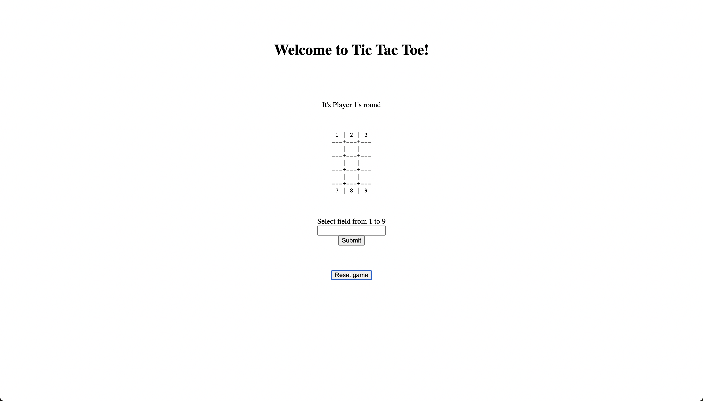

# Welcome to Tic Tac Toe game!

## Rules:

The game is played on a 3x3 grid.

You are X, your opponent is O. Players take turns putting their marks in empty squares.

The first player to get 3 of their marks in a row (up, down, across, or diagonally) is the winner.

If all 9 squares are full and no player has 3 marks in a row, the game is over.

## Installation:

In terminal write `bundle install --path vendor/bundle`

## Run:
To start a server write `bundle exec ruby server.rb` in terminal
Open the browser and select path [localhost:4567/](http://localhost:4567/)

